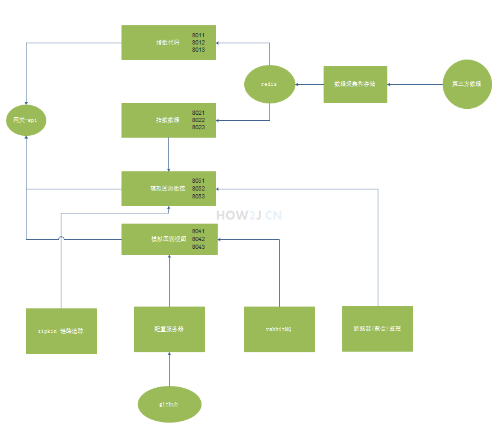

```
eureka-server						8761
third-part-index-data-project		8090
index-gather-store-service			8001
index-codes-service				    8011,8012,8013
index-data-service					8021,8022,8023
index-zuul-service					8031
trend-trading-backtest-view			8041,8042,8043
trend-trading-backtest-service		8051,8052,8053
index-config-server					8060
index-hystrix-dashboard             8070
index-turbine						8080

redis				6379
zipkin				9411
rabbitmq			5672
```


因为视图服务进行了改造，支持了 rabbitMQ, 那么在默认情况下，它的信息就不会进入 Zipkin了。 在Zipkin 里看不到视图服务的资料了。
为了解决这个问题，在启动 Zipkin 的时候 带一个参数就好了：--zipkin.collector.rabbitmq.addresses=localhost
即本来是
java -jar zipkin-server-2.10.1-exec.jar
 
现在改成了
java -jar zipkin-server-2.10.1-exec.jar --zipkin.collector.rabbitmq.addresses=localhost
 
注： 重启 zipkin 后，要再访问业务地址才可以看到依赖关系：
http://localhost:9411/zipkin/dependency/
http://127.0.0.1:8031/api-view/


为了方便监控集群里的多个实例，springCloud 提供了一个 turbine 项目，它的作用是把一个集群里的多个实例汇聚在一个 turbine里，这个然后再在 断路器监控里查看这个 turbine, 这样就能够在集群层面进行监控啦。
注： turbine 是漩涡的意思，就表示把一个集群里的实例的监控信息，都漩啊漩啊的，漩到它这里来了。
访问:http://localhost:8070/hystrix
输入:http://localhost:8080/turbine.stream
